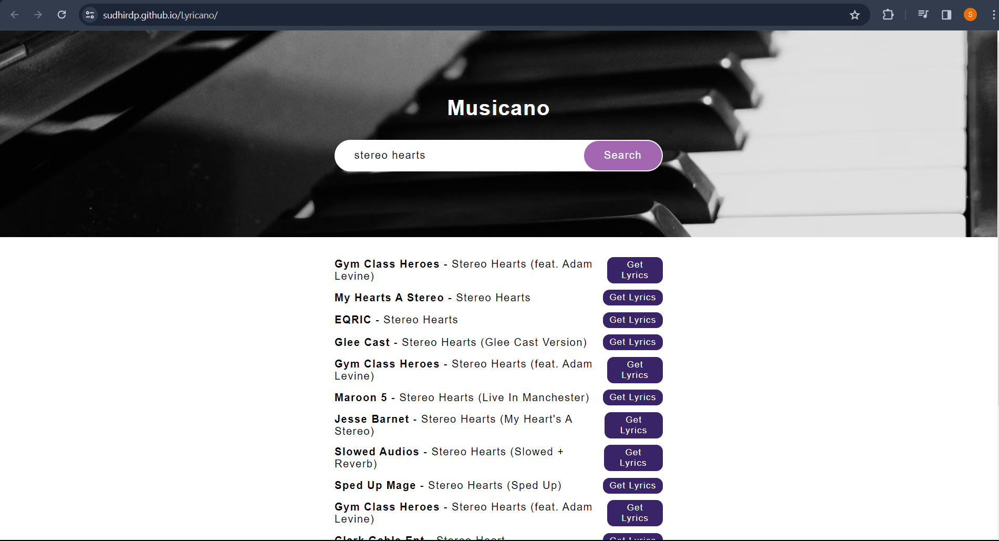

# Lyricano - Lyrics Search

Welcome to **Lyricano**, your go-to tool for exploring song lyrics! 🎶

## Table of Contents

- [Introduction](#introduction)
- [Features](#features)
- [Demo](#demo)
- [Installation](#installation)
- [Usage](#usage)
- [Contributing](#contributing)

## Introduction

Lyricano is a simple and elegant web application that lets you search for your favorite songs and discover their lyrics effortlessly.

## Features

- 🎤 Search for songs or artists.
- 🎵 Get a list of suggested songs.
- 📖 View song lyrics with a single click.
- 🔄 Navigate through song suggestions easily.

## Demo

Here's a quick demo of Musicano in action:

## Installation

1. Clone the repository: `git clone (https://github.com/Sudhirdp/Lyricano.git)`
2. Open `index.html` in your preferred browser.

## Usage

1. Enter the name of the song or artist in the search bar.
2. Click on the "Search" button to get a list of suggested songs.
3. Explore the suggestions and click "Get Lyrics" to view the lyrics of a song.

## API Reference

For learning more about the Lyrics.ovh API, refer to the official documentation: [Lyrics.ovh API Documentation](https://lyricsovh.docs.apiary.io/#)

## Contributing

Contributions are welcome! Follow these steps:

1. Fork the project.
2. Create your feature branch: `git checkout -b feature-name`.
3. Commit your changes: `git commit -m 'Add some feature'`.
4. Push to the branch: `git push origin feature-name`.
5. Open a pull request.

Feel the music with Musicano! 🎶✨
